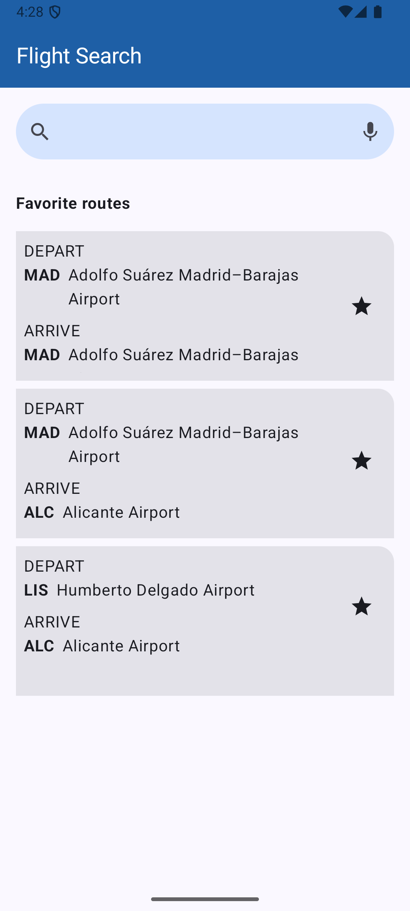
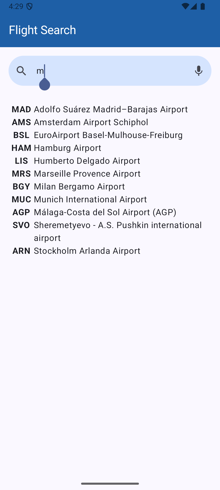
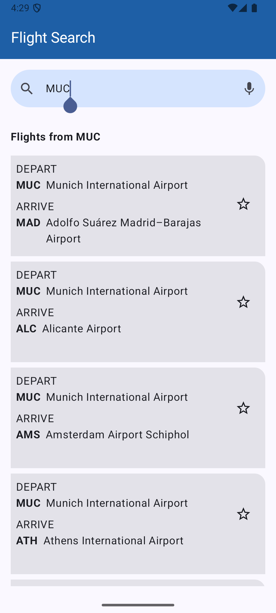

# Flight-Search-App
# ✈️ Flight Search App

The **Flight Search App** allows users to search for airports and view available flight routes based on their selected departure airport.  
Built with **Jetpack Compose**, **Room**, and **DataStore**, this app practices modern Android development techniques including persistent storage and reactive UI.

## Screenshots

## 📋 Project Requirements

This app fulfills the following features:

- 🛫 Provide a **TextField** where users can enter an airport name or IATA airport code.
- 🔍 **Query the Room database** to provide autocomplete suggestions as the user types.
- 📋 Display a **list of flights** from the selected airport, showing both IATA codes and airport names.
- ⭐ Allow users to **save favorite routes** individually.
- 🏠 When no search query is entered, **show all saved favorite routes**.
- 💾 **Save and restore the last search** using **Preferences DataStore**.

## 📱 Features

- **Search Autocomplete**: Dynamic airport suggestions while typing.
- **Flight Results**: Show departure and destination airports.
- **Favorites Management**: Favorite and unfavorite routes easily.
- **Persistent Search State**: Remember last search across app launches.
- **Modern UI**: Built using **Jetpack Compose Material 3**.

## 🛠 Tech Stack

- Kotlin
- Jetpack Compose (Material 3)
- Room Database
- Preferences DataStore
- ViewModel + StateFlow

## ✨ UI Customizations

- Top App Bar styled with deep blue (`#1E5FA6`).
- Search TextField with light blue background (`#D5E4FE`), rounded pill shape.
- Result Cards with only the top-right corner rounded.
- Full Material 3 theme configuration.

## 📂 Project Structure

